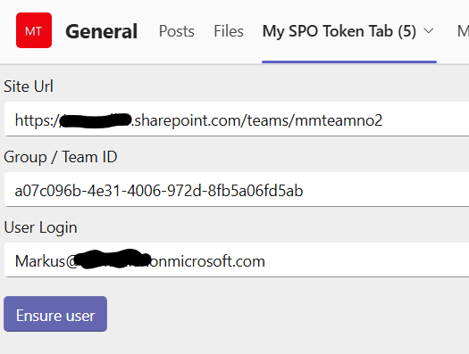

# Tab SSO Graph SPO Refresh

## Summary

This app describes how to establish a Teams Tab as SSO solution including the generation of a second SharePoint access token.
Although Microsoft Graph is the way to go there are still gaps to the original SharePoint Rest/CSOM API. One example is shown in this sample as it is the /_api/web/ensureuser endpoint (in this sample shown in the CSOM variant)

Teams Tab to ensure a SharePoint user in current's Team site



For further details see the author's [blog post](https://mmsharepoint.wordpress.com/2021/06/22/use-sharepoint-rest-api-in-microsoft-teams-with-sso-and-on-behalf-flow/) on a previous version.

## Applies to

This sample was created [using the Teams Toolkit with Visual Studio 2022](https://learn.microsoft.com/en-us/microsoftteams/platform/toolkit/toolkit-v4/teams-toolkit-fundamentals-vs?WT.mc_id=M365-MVP-5004617). The same sample is also realized with the [Teams Toolkit for Visual Studio Code](https://learn.microsoft.com/en-us/microsoftteams/platform/toolkit/teams-toolkit-fundamentals?pivots=visual-studio&WT.mc_id=M365-MVP-5004617) and can be found [here](https://github.com/pnp/teams-dev-samples/samples/tab-sso-graph-spo-refresh-node)

## Frameworks


## Version history

Version|Date|Author|Comments
-------|----|----|--------
1.0|Aug 10, 2024|[Markus Moeller](https://twitter.com/moeller2_0)|Initial release

## Disclaimer

**THIS CODE IS PROVIDED *AS IS* WITHOUT WARRANTY OF ANY KIND, EITHER EXPRESS OR IMPLIED, INCLUDING ANY IMPLIED WARRANTIES OF FITNESS FOR A PARTICULAR PURPOSE, MERCHANTABILITY, OR NON-INFRINGEMENT.**

## Minimal Path to Awesome
- Clone the repository
    ```bash
    git clone https://github.com/pnp/teams-dev-samples.git
    ```
- Open /samples/tab-sso-graph-spo-refresh-cshar/tab-sso-graph-spo-refresh-csharp.sln in Visual Studio 2022
- Perform first actions in GettingStarted.txt (before hitting F5) 
- Ensure the permissions of your Entra ID app are consented tenant-wide
- Press F5
- When Teams launches in the browser, select the Add button in the dialog to install your app to a Team of your choice
- Confirm the Configuration screen with Save
  
## Features
- Using Blazor FluentUI 9 compontents
- Generating Entra ID access tokens for Microsoft Graph but also SharePoint CSOM Api access 

